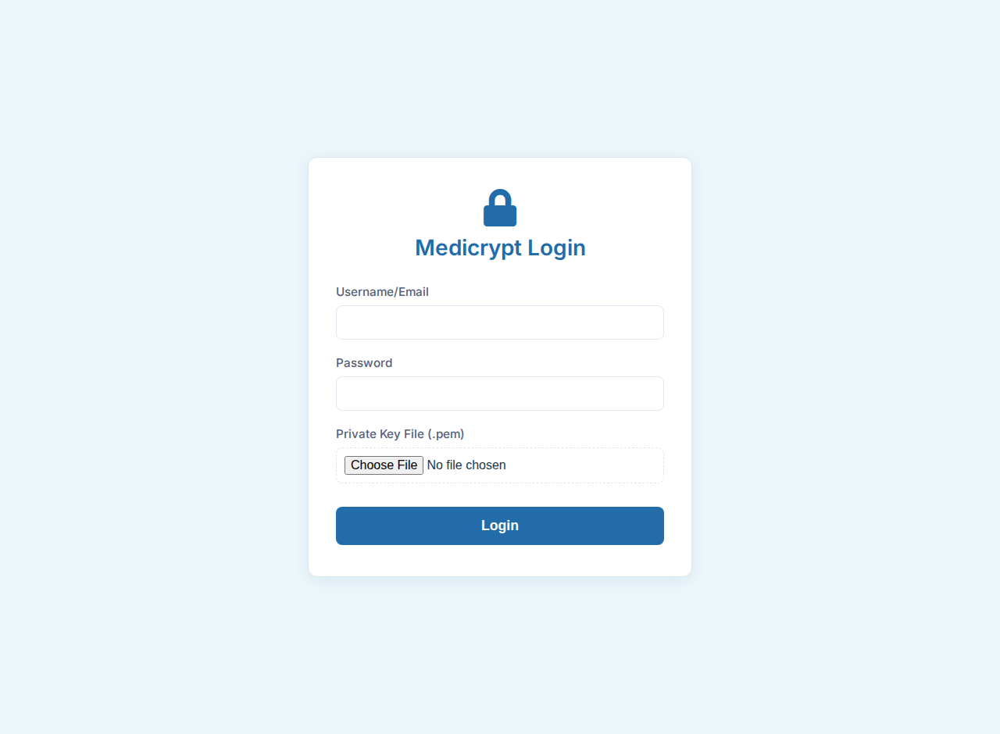
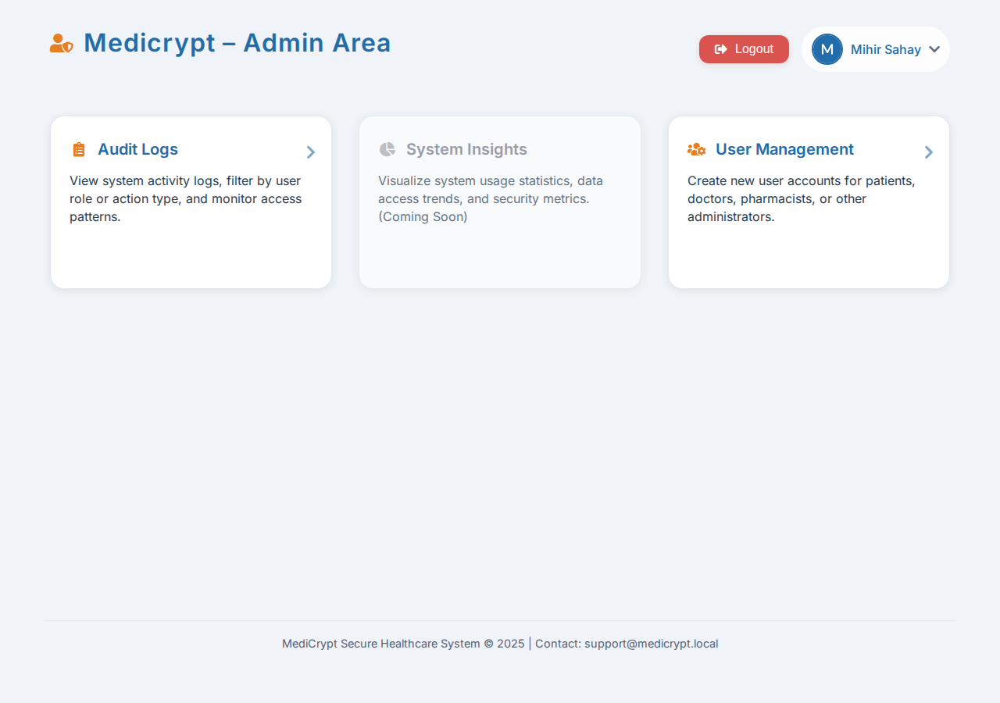
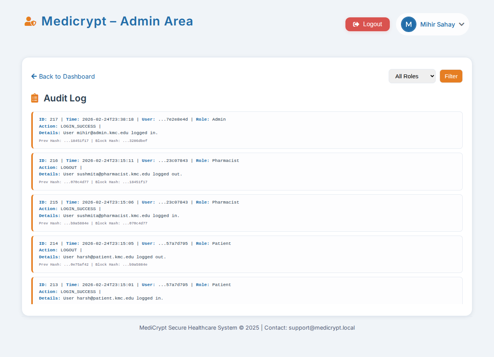
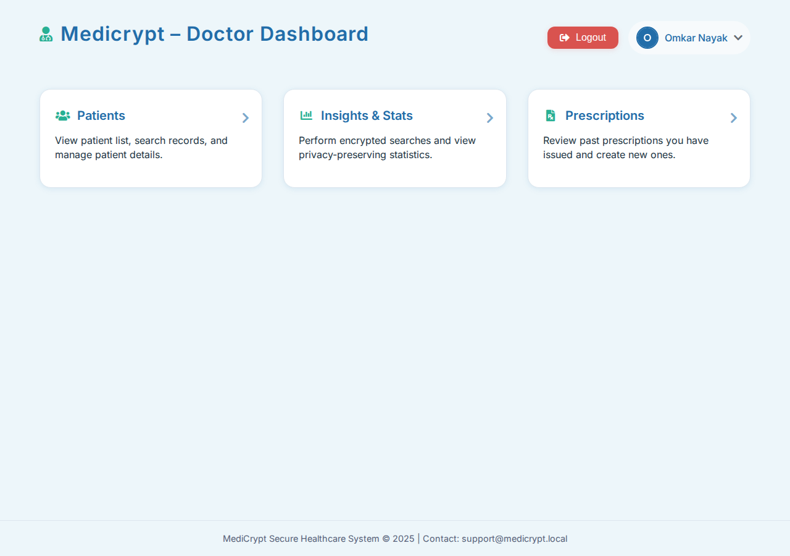
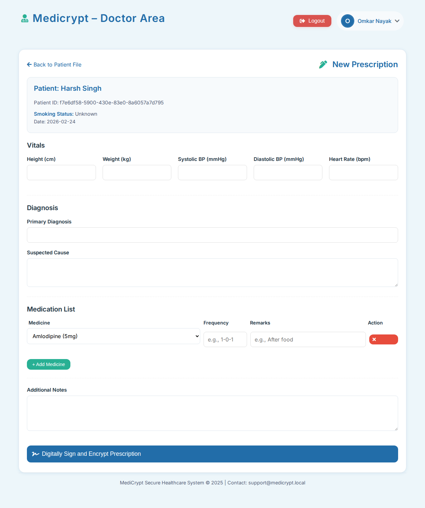
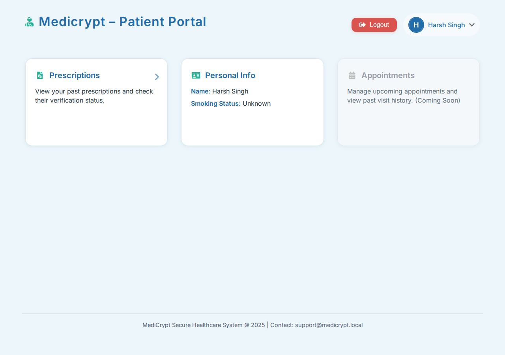
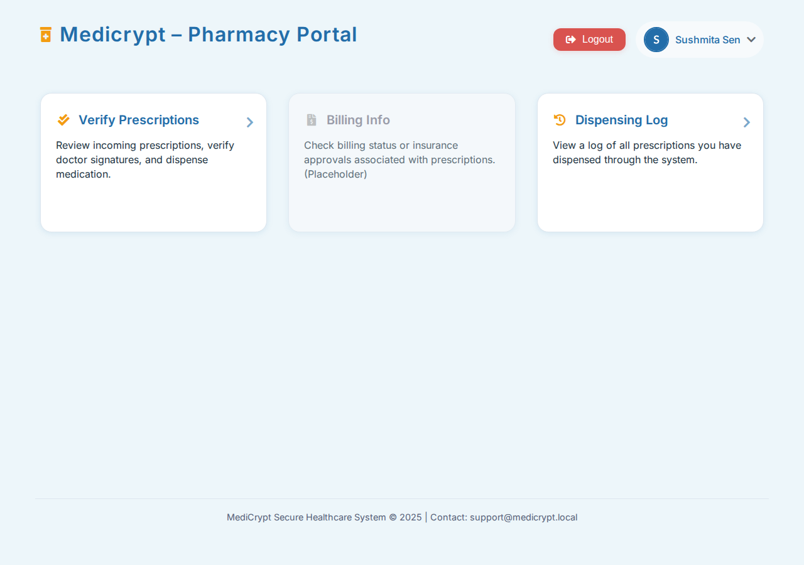
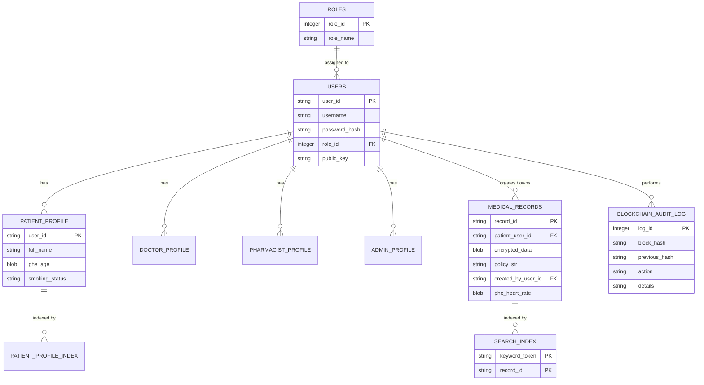

<p align="center">
  
  
  
  
  
</p>

<h1 align="center">🏥 MediCrypt</h1>

<p align="center">
  <strong>A highly secure, cryptographically enforced Medical Record & Hospital Management System.</strong><br/>
  Designed to ensure patient privacy, robust role-based access control, and differential privacy for statistical analysis.
</p>

---

## ✨ Features & Cryptography

<details open>
<summary><strong>🔐 Symmetric Data Encryption</strong></summary>
<br/>
<p><strong>AES-256 (CBC Mode)</strong>: All medical records and prescriptions are encrypted at rest using a unique Data Encryption Key (DEK) derived via PBKDF2 from a Master Key. AES ensures the bulk string storage of medical records remains entirely protected against disk-level breaches.</p>
</details>

<details open>
<summary><strong>✍️ Digital Signatures</strong></summary>
<br/>
<p><strong>RSA 2048-bit (PKCS#1 v1.5)</strong>: Guarantees non-repudiation. Doctors cryptographically sign prescription payloads with their local private keys; pharmacists rely on the backend verification to dispense drugs securely without doubt of origin or tampering.</p>
</details>

<details open>
<summary><strong>🧮 Partially Homomorphic Encryption (PHE)</strong></summary>
<br/>
<p><strong>Paillier Cryptosystem</strong>: Numeric vitals (like age, heart rate, weight) are encrypted at the field level. The Flask backend utilizes additive homomorphism to sum up encrypted patient data directly from SQLite without decrypting the contents first, preserving ultimate privacy during hospital-wide analytics generation.</p>
</details>

<details open>
<summary><strong>🔍 Searchable Symmetric Encryption (SSE)</strong></summary>
<br/>
<p><strong>HMAC-SHA256</strong>: Deterministic tokens represent diagnoses and physical conditions in a reverse <code>search_index</code> table, enabling secure database queries without exposing plaintext search keys.</p>
</details>

<details open>
<summary><strong>📊 Differential Privacy (DP)</strong></summary>
<br/>
<p><strong>Laplace Mechanism</strong>: Integrates <code>diffprivlib</code> to add mathematically calibrated statistical noise to the final decrypted aggregates. This protects the aggregated models from <i>Linkage</i> and <i>Inference</i> attacks that could single out an individual's data points.</p>
</details>

<details open>
<summary><strong>⛓️ Immutable Audit Ledger</strong></summary>
<br/>
<p><strong>Blockchain-Inspired Approach</strong>: Tracks every login and critical administrative action. Each log entry is bound to the previous via chained SHA-256 hashing. Modifying a historical log instantaneously invalidates the whole chain block tree.</p>
</details>

---

## 📸 Application Screenshots

<details open>
<summary><strong>🔐 Authentication</strong></summary>
<br/>
<p align="center">
  
</p>
<p align="center"><em>Secure Key-Based Authentication.</em></p>
</details>

<details>
<summary><strong>🧑‍💼 Admin View</strong></summary>
<br/>
<p align="center">
  
</p>
<p align="center"><em>At-a-glance system status, tile navigation.</em></p>
<br/>
<p align="center">
  
</p>
<p align="center"><em>Immutable blockchain audit logs for deep system tracking.</em></p>
<br/>
<p align="center">
  
</p>
<p align="center"><em>Differentially private aggregate statistics logic natively calculating encrypted metrics.</em></p>
</details>

<details>
<summary><strong>🩺 Doctor Interface</strong></summary>
<br/>
<p align="center">
  
</p>
<p align="center"><em>Primary clinical dashboard.</em></p>
<br/>
<p align="center">
  
</p>
<p align="center"><em>Prescribing interface with underlying RSA signature generation.</em></p>
<br/>
<p align="center">
  
</p>
<p align="center"><em>Encrypted record viewing securely accessed from search indexes.</em></p>
</details>

<details>
<summary><strong>🛏️ Patient View</strong></summary>
<br/>
<p align="center">
  
</p>
<p align="center"><em>Read-only dashboard of a patient's historical medical records.</em></p>
</details>

<details>
<summary><strong>💊 Pharmacist Access</strong></summary>
<br/>
<p align="center">
  
</p>
<p align="center"><em>Overview of un-dispensed physical prescriptions.</em></p>
<br/>
<p align="center">
  
</p>
<p align="center"><em>Dispensing interface forcing live cryptographic RSA signature verification.</em></p>
</details>

---

## 🛠️ Tech Stack

| Layer | Technology |
|---|---|
| **Backend Framework** | Python 3 |
| **Web API / Router** | Flask |
| **Database Engine** | SQLite3 |
| **Authentication** | Custom session-based auth with `bcrypt` / RSA |
| **Cryptography** | `pycryptodome`, `phe` (Paillier), `diffprivlib` |
| **Frontend Styling** | HTML5, CSS3, Jinja2 Templates |

---

## 📁 Project Structure

```text
MediCrypt/
├── app.py                       # Main Flask entrypoint & app configuration
├── auth.py                      # Registration, bcrypt login, and RSA key verification
├── crypto.py                    # AES, RSA, Paillier PHE, and SSE logic
├── database.py                  # SQLite connection and role schema seeding
├── blockchain.py                # Immutable audit ledger logic
├── routes/                      # Modular Flask blueprints
│   ├── admin/
│   │   ├── logs.py              # Blockchain log viewer
│   │   ├── stats.py             # Differential privacy analytics
│   │   └── user_management.py   # Secure admin user creation
│   ├── doctor.py                # Doctor dashboard and prescriptions
│   ├── patient.py               # Patient view
│   └── pharmacist.py            # Pharmacist verification dashboard
├── templates/                   # Jinja2 HTML templates
└── dummy_keys/                  # Generated test RSA private keys (GitIgnored)
```

---

## 🗄️ Database Schema



---

## 🚀 Getting Started

### Prerequisites
- **Python** 3.12+

### Installation & System Setup

```bash
# 1. Clone the repository & enter it
# 2. Setup Virtual Environment
python -m venv .venv
source .venv/bin/activate
pip install -r requirements.txt

# 3. Seed the Database
python database.py
python reset_database.py
python seed_users.py
python seed_medicines.py

# 4. Run the Server
python app.py
```
Then open **http://localhost:5000** in your browser.

---

## 🔑 Default Login Credentials

Upon running `seed_users.py`, RSA private keys are generated in the local `dummy_keys/` directory. You must supply *both* the password and the matching `.pem` file during the secure web login handshake.

| Role | Username | Password |
|---|---|---|
| **Admin** | `mihir@admin.kmc.edu` | `Admin@1234` |
| **Doctor** | `omkar@doctor.kmc.edu` | `Doctor@123` |
| **Patient** | `harsh@patient.kmc.edu` | `Patient@123` |
| **Pharmacist**| `sushmita@pharmacist.kmc.edu`| `Pharm@1NET`|

---

## 👨‍💻 Contributors

| Name | GitHub |
|---|---|
| **Mihir Sahay** | [@sahaymihir](https://github.com/sahaymihir) |
| **Rishi Khandelwal** | [@RishiK1706](https://github.com/RishiK1706) |
| **Omkar Nayak B** | [@omkar3599](https://github.com/omkar3599) |

---
